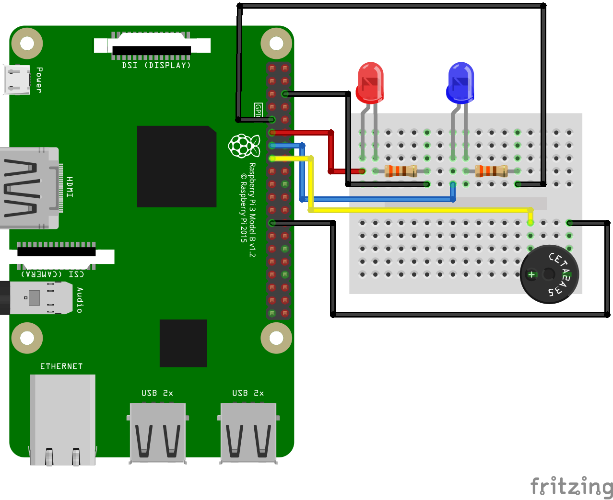

## Linux Format 255 - Anvil GPIO Control

In issue 255 of LXF we explore how to use [Anvil](https://anvil.works) to control the GPIO of a Raspberry Pi 4.

You can take a look at the code and form for this [app via this link](https://anvil.works/build#clone:PKQCGTW4EKJLD2NJ=OIC54UWNW6KPSQ3KW6AZRC7C)

### How far can we take this?
[We can control robots with this tech!](https://www.youtube.com/embed/tHkkRLKwsq4)

